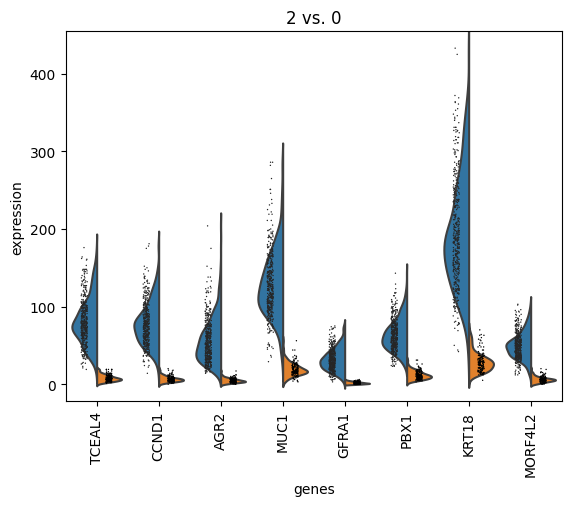
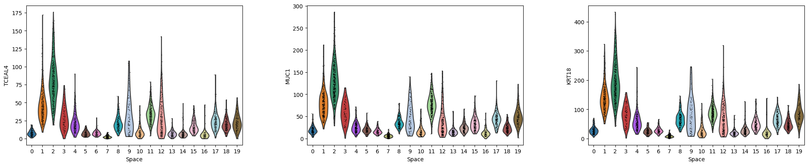

# Space

Reconciling Multiple Spatial Domain Identification Algorithms via Consensus Clustering

## 1. Introduction

**Space** is a spatial domain identification method from <u>spa</u>tially resolved transcriptomics (SRT) data using <u>c</u>onsensus clust<u>e</u>ring. It integrates **10 SOTA algorithms**. Space selects reliable algorithms by measuring their consistency. Then, it constructs a consensus matrix to integrate the outputs from multiple algorithms. We introduce **similarity loss**, **spatial loss**, and **low-rank loss** in Space to enhance accuracy and optimize computational efficiency.

<center>
    
    <br>
    <div style="color:orange; border-bottom: 1px solid #d9d9d9;
    display: inline-block;
    color: #999;
    padding: 2px;">Space Workflow</div>
</center>

The integrated methods:
- [x] **GraphST**
- [x] **Leiden**
- [x] **MENDER**
- [x] **Louvain**
- [x] **SEDR**
- [x] **SpaceFlow**
- [x] **SpaGCN**
- [x] **STAGATE**
- [x] **stGCL**
- [x] **stLearn**


The **organization** of this repository file is as follows:

```shell
Space/  
├── Data/                    # data for reproducibility
├── Demo/  
│   ├── Reference_Methods/   # the scripts of 10 SOTA algorithms
│   └── Reproduce_Scripts/   # the scripts for reproducing results in manuscript
├── Images/                  # images
├── Space/                   # Space source code
├── CITATION.cff             # CItation file
├── LICENSE                  # LICENSE file
├── setup.sh                 # Installation file
└── environment.yml          # conda/mamba environment file
```


## 2. Installation Tutorial

The deployment of Space requires a Linux/Unix machine. We recommend using [conda](https://anaconda.org/anaconda/conda)/[mamba](https://github.com/conda-forge/miniforge) and create a virtual environment to manage all the dependencies. If you did not install conda before, please install [conda](https://anaconda.org/anaconda/conda)/[mamba](https://github.com/conda-forge/miniforge) first.

We provide the environment file, allowing users to quickly deploy Space using the following command.

```shell
# clone or download this repository
git clone https://github.com/Honchkrow/Space

# enter the folder
cd Space

chmod +x setup.sh

# install environment using setup.sh based on conda or mamba
# The script will check the configure settings automatically.
bash setup.sh conda  # or "bash setup.sh mamba"

# activate environment
conda activate space  # or "mamba activate space"

# install bokeh and stlearn
pip install --no-deps bokeh==3.4.2 stlearn==0.4.12
```

*<font color=red>Note:</font> Please note that if there is already an environment named "space" in conda/mamba, it will lead to a failure due to name conflict. Be sure to resolve any naming issues with the environment in advance.*


For common installation issues, please refer to [FAQ](#4-faq).


## 3. How to use Space

In this section, we will use a SRT dataset to provide a detailed introduction to the functionalities of Space.

### 3.1 Preparing the Datasets

In the manuscript for Space, we present the results of Space on four different datasets. These datasets are:

- [Human breast cancer](https://support.10xgenomics.com/spatial-gene-expression/datasets/1.1.0/V1_Breast_Cancer_Block_A_Section_1): This dataset contains 3,798 spots and 36,601 genes, along with 20 manually annotated regions.
- [Mouse hypothalamus](https://datadryad.org/stash/dataset/doi:10.5061/dryad.8t8s248): This dataset includes 5 tissue sections, with 8 regions manually annotated, and the number of spots varies from 5,488 to 5,926.
- [Mouse primary visual area](https://spacetx.github.io/data.html): This dataset comprises three slices, containing 3390, 4491, and 3545 spots, respectively, for a total of 79 genes. Manual annotation was performed on six visual cortex layers, ranging from VISP_I to VISP_VI, as well as the white matter region (VISpwm).
- [Mouse visual cortex](https://www.starmapresources.com/data): This dataset includes three tissue sections_BZ5, BZ9, and BZ14_which have spot counts of 1049, 1053, and 1088, respectively, amounting to a total of 166 genes. Manual annotation was conducted for four regions.

We have prepared two types of data. The first type consists of results on four datasets, obtained using ten SOTA algorithms. This data is in CSV format, which allows users to quickly reproduce the results of the Space article. **This data is already integrated into this repository, so users do not need to download it separately.** The second type is the processed SRT data, which includes gene expression matrices, spatial location information, and H&E images. Due to the large size of this data, it cannot be uploaded to GitHub. Therefore, users will need to download it.

#### Download the processed SRT datasets (not mandatory)

To facilitate user access, we have uploaded the processed SRT datasets to **[Google Drive](https://drive.google.com/drive/folders/1rXn5_HYpFo514hQXepZnaNJAD5xq9o4Z?usp=drive_link)** and **[BaiduYun](https://pan.baidu.com/s/1qxoq0ttp0BzsvLzBtDUgIg?pwd=3vvv)**. Users can directly download and use them.

To facilitate users in quickly reproducing our results, they can merge the extracted 'Data' folder with the 'Data' folder in the Space project. This can be done immediately after downloading and unzipping the files.The **organization** of this project will become:

```shell
# Only shows the BARISTASeq dataset.
# Mouse_hippocampus_MERFISH, SRARmap_pa and V1_Breast_Cancer_Block_A_Section_1 are the same.
Space/  
├── Data/
│   ├── BARISTASeq/
│   │   ├── BARISTASeq_Sun2021Integrating_Slice_1_data.h5ad
│   │   ├── BARISTASeq_Sun2021Integrating_Slice_2_data.h5ad
│   │   ├── BARISTASeq_Sun2021Integrating_Slice_3_data.h5ad
│   │   ├── result1.csv
│   │   ├── result2.csv
│   │   └── result3.csv
│   ├── Mouse_hippocampus_MERFISH/  # not show
│   ├── SRARmap_pa/  # not show
│   └── V1_Breast_Cancer_Block_A_Section_1/  # not show
├── Demo/  
│   ├── Reference_Methods/
│   └── Reproduce_Scripts/
├── Images/
├── Space/
└── Other Files
```


### 3.2 Performing Concensus Clsutering using Space (Reproducibility)

In this section, we will show how to perform the Clsutering using Space.

Also, to reproduce the results of our article, users can run the scripts in the **Demo** folder. The scripts are organized into two folders: **Reference_Methods** and **Reproduce_Scripts**. The **Reference_Methods** folder contains scripts for reproducing the results of the 10 SOTA algorithms. The **Reproduce_Scripts** folder contains scripts for reproducing the results of the Space.

#### 3.2.1 Step-by-step Tutorial for Procesing Breast Cancer Dataset

Here, for quick illustration, we directly apply Space to the results obtained from 10 SOTA methods. These methods have already been executed. The scripts are saved in **Reference_Methods** folder. The results of these methods are saved in the **Data** folder.

First, load the necessary packages and set R environment. 

*<font color=red>Please note that in the code below, the R environment must be the one installed within Space. Users need to replace it according to the installation directory of Space.</font>*

```python
import os
import scanpy as sc
import pandas as pd
import Space
from sklearn.metrics import adjusted_rand_score
from sklearn.cluster import SpectralClustering
from Space.cons_func import get_results, get_domains
from Space.utils import calculate_location_adj, plot_results_ari, get_bool_martix, plot_ari_with_removal

# Some methods need mclust.
# Please modify this path!
os.environ["R_HOME"] = "/home/zw/software/miniforge3/envs/space/lib/R"
```

Next, load the dataset.

```python
# read the expression data
adata = sc.read_visium(
    path="./Data/V1_Breast_Cancer_Block_A_Section_1", 
    count_file="filtered_feature_bc_matrix.h5"
)

# read the metadata
Ann_df = pd.read_csv(
    "./Data/V1_Breast_Cancer_Block_A_Section_1/metadata.tsv",
    sep="\t",
    header=0,
    na_filter=False,
    index_col=0,
)
adata.var_names_make_unique()

# read the image representation
im_re = pd.read_csv(
    "./Data/V1_Breast_Cancer_Block_A_Section_1/image_representation/ViT_pca_representation.csv",
    header=0,
    index_col=0,
    sep=",",
)

# set variables
adata.obsm["im_re"] = im_re
adata.obs["gt"] = Ann_df["fine_annot_type"]
gt = adata.obs["gt"]
```

Then, set the parameters.

```python
k = 20                   # number of clusters
epochs = 120             # epoch in training
seed = 666               # random seed
alpha = 1                # recommended value
learning_rate = 0.0001   # learning rate in training
```

Now, read the results from 10 SOTA methods. To quickly reproduce the results, we directly read the outcomes from 10 SOTA methods. The code for these methods can be found in the "**/Demo/Reference_Methods/breast**" folder.

```python
mul_reults = pd.read_csv(
    "./Data/V1_Breast_Cancer_Block_A_Section_1/result.csv", 
    header=0, 
    index_col=0
)
mul_reults = mul_reults.iloc[:, 2:]
```

Next, we can observe the consistency between the results of different methods and discard the inconsistent methods.

```python
# drop 2 methods that show poor consistency
mul_reults = plot_ari_with_removal(mul_reults, 2)
```

<center>
    
    <br>
    <div style="color:orange; border-bottom: 1px solid #d9d9d9;
    display: inline-block;
    color: #999;
    padding: 2px;">Consistency between different methods</div>
</center>


```python
# compute the positional similarity matrix
pos_similarity = calculate_location_adj(adata.obsm["spatial"], l=123)

# create the model
model = Space.Space(
    get_bool_martix(mul_reults),
    pos_similarity,
    epochs=epochs,
    gt=gt.values,
    k=k,
    seed=seed,
    alpha=alpha,
    beta=1,
    learning_rate=learning_rate,
)

# tarining model
con_martix = model.train()

# set spectral cluster model
sClustering = SpectralClustering(n_clusters=k, affinity="precomputed", random_state=666)

# clustering
labels = sClustering.fit_predict(con_martix)

ari = adjusted_rand_score(labels, gt.values)

print(ari)
```

you will obtain a result from Space with an ARI of **0.648**.

**<font color=red>In some cases, Space does not yield a fixed result. This is not due to an issue with Space, but because some methods exhibit randomness even when the random seed is fixed. Please refer to 'https://github.com/QIFEIDKN/STAGATE/issues/10' for more information. However, the variations in the results we obtain are minimal. The outcomes are stable across multiple runs.</font>**

Next, we can vislize the clustering results.

```python
# assign label to adata
adata.obs["Space"] = labels
adata.obs["Space"] = adata.obs["Space"].astype('str')

# plotting the results
sc.pl.spatial(adata, color="Space", title='Space (ARI=%.2f)'%ari)
```

<center>
    
    <br>
    <div style="color:orange; border-bottom: 1px solid #d9d9d9;
    display: inline-block;
    color: #999;
    padding: 2px;">Consistency between different methods</div>
</center>

 Using SCANPY, we can also analysis the domian-specific genes.

```python
sc.tl.rank_genes_groups(adata, 'Space', groups=["2"], reference="0", method='wilcoxon')
sc.pl.rank_genes_groups(adata, groups=['2'], n_genes=20)
```

<center>
    
    <br>
    <div style="color:orange; border-bottom: 1px solid #d9d9d9;
    display: inline-block;
    color: #999;
    padding: 2px;">Consistency between different methods</div>
</center>

```python
sc.pl.rank_genes_groups_violin(adata, groups='2', n_genes=8)
 ```

We can compare the genes from different domain.

<center>
    
    <br>
    <div style="color:orange; border-bottom: 1px solid #d9d9d9;
    display: inline-block;
    color: #999;
    padding: 2px;">Consistency between different methods</div>
</center>


We can also visual the distribution of genes across all domains.

```python
sc.pl.violin(adata, ['TCEAL4', 'MUC1', 'KRT18'], groupby='Space')
```

<center>
    
    <br>
    <div style="color:orange; border-bottom: 1px solid #d9d9d9;
    display: inline-block;
    color: #999;
    padding: 2px;">Consistency between different methods</div>
</center>

### 3.3 Performing domain identification in a pipeline manner

For user convenience, we also provide a pipeline code that allows for the one-time execution of all methods. Here, we mainly introduce the interface in Space.

In "Space.cons_func," we offer interfaces for 10 baseline methods. Users only need to configure the parameters according to the requirements of each method and then pass them to the corresponding module.

The key code is as follows.

```python
# import the modules for each method
from Space.cons_func import get_results
from Space.cons_func import (
    run_GraphST,
    run_Leiden,
    run_MENDER,
    run_SCANPY,
    run_SEDR,
    run_SpaceFlow,
    run_SpaGCN,
    run_STAGATE,
    run_stGCL,
    run_stLearn,
)

# Define the parameters for each method
# 'adata' and 'k' is the same as demo in section 3.2
func_dict = {
    run_GraphST: {"input_adata": adata, "n_cluster": k, "radius": 50, "random_seed": 200},
    run_Leiden: {"input_adata": adata, "random_state": 0},
    run_MENDER: {"input_adata": adata, "n_cluster": k, "scale": 2, "radius": 6, "random_seed": 1},
    run_SCANPY: {"input_adata": adata, "resolution": 0.5, "random_state": 0},
    run_SEDR: {"input_adata": adata, "n_cluster": k, "random_seed": 0},
    run_SpaceFlow: {"input_adata": adata, "resolution": 1.5, "n_neighbors": 50, "random_seed": 8},
    run_STAGATE: {"input_adata": adata, "n_cluster": k, "random_seed": 6},
    run_stGCL: {
        "input_adata": adata,
        "n_cluster": k,
        "radius": 70,
        "epoch": 100,
        "use_image": True,
        "seed": 0,
    },
    run_stLearn: {
        "input_adata": adata,
        "n_cluster": k,
    },
    run_SpaGCN: {"input_adata": adata, "max_epochs": 20, "seed": 4},
}

# get the result from each method
collected_results = get_results(func_dict, use_multithreading=False, monitor_performance=True)
```

Here, wo provide a simple demo using breast cancer dataset [here](https://github.com/Honchkrow/Space/blob/main/Demo/Reproduce_Scripts/demo_pipeline.py).Users  need to set up the data according to Section 3.1. After that, they can directly run the code provided below.

```shell
python demo_pipeline.py
```


### 3.4 How to selecte different methods by hand

Sometimes, particularly when it involves known prior knowledge (such as morphological knowledge), users may wish to manually filter the results of de-identification. Space retains an interface for manual screening. Here, we provide a specific code example using the MERFISH dataset to demonstrate how to perform manual filtering.

```python
import os
import scanpy as sc
import pandas as pd

os.environ["R_HOME"] = "/home/zw/software/miniforge-pypy3/envs/space/lib/R"
import Space
slide_id = "19"
from Space.cons_func import (
    run_GraphST,
    run_Leiden,
    run_MENDER,
    run_SCANPY,
    run_SEDR,
    run_SpaceFlow,
    run_SpaGCN,
    run_STAGATE,
    run_stGCL,
    run_stLearn,
)
from sklearn.metrics import adjusted_rand_score
from sklearn.cluster import SpectralClustering
from Space.cons_func import get_results, get_domains
from Space.utils import calculate_location_adj, plot_results_ari, get_bool_martix,plot_ari_with_removal

adata = sc.read(f"./Data/Mouse_hippocampus_MERFISH/hip_adata-0.{slide_id}.h5ad")
adata.var_names_make_unique()

gt = adata.obs["ground_truth"]
k = 8  # n_clusters
epochs = 300
seed = 666
alpha = 4
learning_rate = 0.0001

# Define a dictionary where the key is a subfunction and the value is a dictionary of parameters
func_dict = {
    run_GraphST: {"input_adata": adata, "n_cluster": k, "random_seed": 4},
    run_Leiden: {"input_adata": adata, "random_state": 0},
    run_MENDER: {"input_adata": adata, "n_cluster": k, "scale": 2, "radius": 6, "random_seed": 2},
    run_SCANPY: {"input_adata": adata, "resolution": 2, "random_state": 3},
    run_SEDR: {"input_adata": adata, "n_cluster": k, "random_seed": 0},
    run_SpaceFlow: {"input_adata": adata, "n_neighbors": 50, "random_seed": 7},
    run_STAGATE: {"input_adata": adata, "n_cluster": k, "rad_cutoff": 60, "random_seed": 1},
    run_stGCL: {
        "input_adata": adata,
        "n_cluster": k,
        "radius": 70,
        "epoch": 800,
        "rad_cutoff": 60,
        "seed": 0,
    },  ##?
    run_stLearn: {"input_adata": adata, "n_cluster": k, "random_state": 0},
    run_SpaGCN: {"input_adata": adata, "seed": 2},
}

# To save time and ensure the stability of the results, we can use the results we obtained in advance:
mul_reults = pd.read_csv(f"./Data/Mouse_hippocampus_MERFISH/result{slide_id}.csv", header=0, index_col=0)
mul_reults = mul_reults.iloc[:, 2:]

plot_results_ari(mul_reults)

# remove methods by hand
mul_reults = mul_reults.drop("SCANPY", axis=1)
mul_reults = mul_reults.drop("SEDR", axis=1)
mul_reults = mul_reults.drop("Graphst", axis=1)
mul_reults = mul_reults.drop("Leiden", axis=1)
mul_reults = mul_reults.drop("MENDER", axis=1)
mul_reults = mul_reults.drop("SpaGCN", axis=1)
mul_reults = mul_reults.drop("stLearn", axis=1)

pos_similarity = calculate_location_adj(adata.obsm["spatial"], l=123)

model = Space.Space(
    get_bool_martix(mul_reults),
    pos_similarity,
    epochs=epochs,
    gt=gt.values,
    k=k,
    seed=seed,
    alpha=alpha,
    beta=1,
    learning_rate=learning_rate,
)

con_martix = model.train()
sc = SpectralClustering(n_clusters=k, affinity="precomputed", random_state=epochs)
labels = sc.fit_predict(con_martix)
adata.obs["consensus"] = labels
ari = adjusted_rand_score(labels, adata.obs["ground_truth"].values)
print(ari)
```

The final ARI is **0.674**.


## 4 FAQ

### 4.1 Too many open files: '/proc/cpuinfo'

If you encounter the error **<font color=blue>Too many open files: '/proc/cpuinfo'</font>**, it means that the number of open files has exceeded the limits set by the Linux system during the environment installation. You can resolve this issue by using the command "ulimit -n number". A non-root user can set this limit to a maximum of 4096 with "ulimit -n 4096". However, we recommend that the root user set the limit to "ulimit -n 65535".*

### 4.2 Unavailable or invalid channel

If errors about **<font color=blue>unavailable or invalid channel</font>** occur, please check that whether the **.condarc** file in your ~ directory had been modified. Modifing .condarc file may cause wrong channel error. In this case, just rename/backup your .condarc file. Once the installation finished, this file can be recoveried. Of course, you can delete .condarc file if necessary.*

### 4.3 CUDA version mismatch

When running the **setup.sh** script, users may encounter an error indicating that **<font color=blue>the CUDA version is incompatible with the installed packages (such as torch_scatter and torch-sparse)</font>**. This issue arises because CUDA is required for compiling torch_scatter and torch-sparse. The version of CUDA required by Space is 11.3.1. To resolve this issue, you can install the cudatoolkit using conda or mamba.

Next, create a new environment and install cudatoolkit.

```shell
mamba create -n cuda_11.3.1
mamba install conda-forge::cudatoolkit-dev=11.3.1
```

Then, add the following content to the "~/.bashrc".

```shell
# please change the path to your own
export PATH="/home/zw/software/miniforge3/envs/cuda_11.3.1/pkgs/cuda-toolkit/bin:$PATH"
```
Next, you can either open a new console or activate the  CUDA by running "source ~/.bashrc".

You can the cuda version.

```shell
nvcc --version
```

Now, you can reinstall using the tutorial above. Please note to  delete the previously installed environment named "space". Otherwise, you will receive an error stating that the environment already exists (but the environment is incomplete).

```shell
mamba remove -n space -y --all
```


## 5 Citation

Please see citation widget on the sidebar.
